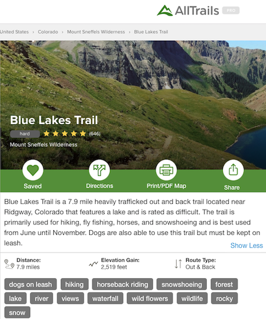
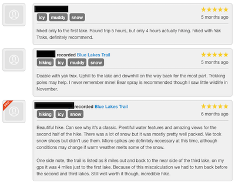
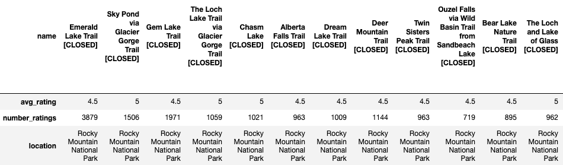
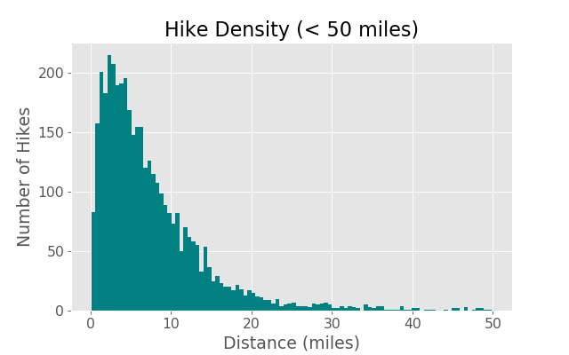
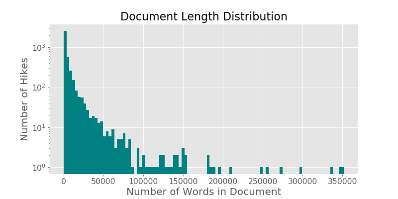
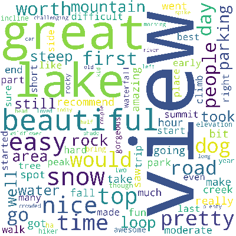
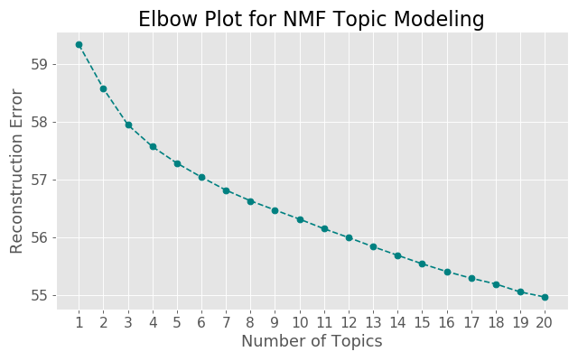

# [Colorado Hiking Trail Recommender](http://ec2-3-235-195-173.compute-1.amazonaws.com:8080/)
> Annie Rumbles

## _[Web App (click here!)](http://ec2-3-235-195-173.compute-1.amazonaws.com:8080/)_

## Table of Contents
- [Motivation and Background](#motivation-and-background)
- [Workflow](#workflow)
- [Data](#the-data)
    * [Web Scraping](##web-scraping)
    * [Cleaning](##data-cleaning)
- [Initial EDA](#initial-exploratory-data-analysis)
- [Topic Modeling](#topic-modeling)
    * [Topics](##the-topics)
- [Content-Based Recommender](#recommender)
- [Citations](#citations)

---
# Motivation and Background

I **love** hiking. When the weather starts to turn from the depths of winter to spring and summer, heck, even when fall is turning back to winter, I am constantly thinking about what hikes I should do. I have spent countless hours scouring a website called [Alltrails](https://www.alltrails.com/) making lists of trails I want to explore with my dog. This process can take quite a bit of time and it got me wondering... *is there a better way to do this?* 

# Workflow

# Data

## Web Scraping

The Alltrails website hosts 100,000+ trails for users to peruse and pick their next adventure. Using Beautiful Soup, Selenium, and MongoDB I scraped all hikes in Colorado, more than 4,000 entries. Each entry looks like the screen grabs below with some photos and maps as well as some basic information about the hike including the hike name, general description, average star rating, number of ratings, general location, trail distance, trail elevation gain, trail difficulty, tags associated with the hike, and user-inputted ratings and reviews - this is the content I decided to scrape.

  

I scraped this data into a MongoDB database into different collections so that I could export the json-like files and load them into Pandas directly.

## Data Cleaning
I split the data into two data sets to begin with. One containing the hike information which included 'name', 'avg_rating', 'worst_rating', 'best_rating', 'number_ratings', 'location', 'distance', 'elevation', 'difficulty', 'hike_type', 'tags'. And another data set containing all the text data that I scraped. The hike information data set was 4022 rows and 10 columns (before one-hot encoding) and the text data set became a corpus of 3998 documents (the loss of 24 rows came when merging the review and description texts). I made the index of the dataframe the name of the hike. The features 'avg_rating', 'worst_rating', 'best_rating', 'number_ratings', 'distance', and 'elevation' were all integers or floats to being with, and 'location', 'difficulty', 'hike_type', and 'tags' were strings. I decided to drop the 'location' feature instead of one-hot encoding because there were more that 550 locations and I didn't feel this feature would benefit my topic modeling. I then one-hot encoded the 'difficulty' and 'hike_type' features. 

One challenging hurdle I came across was how to deal with hikes that contained "[CLOSED]" in the hike name. Alltrails seems to apply this to the hike name for any number of reasons, whether the trail is permanently or temporarily closed. I initially thought about dropping all rows with this demarkation but noticed that it was applied to hikes that I know to be available, but are temporarily closed because of the current COVID-19 pandemic. This particularly applies to Rocky Mountain National Park which accounts for about 200 of Colorado's hikes on Alltrails. So I decided to keep all hikes, including those with "[CLOSED]" in the hike title. Below I have included a sampling of hikes in Rocky Mountain National Park showing these hike names and also the popularity of these hikes and whose text value really was necessary in my corpus. 

# Initial Exploratory Data Analysis

In order to get a grasp of the data as a whole, I used the hike information data set mostly for my initial EDA. I looked at how the hikes were distributed over distance (less than 50 miles), to get a sense of the proportions of shorter and longer hikes that would be grouped when clustering and topic modeling.

Most hikes only had a few words associated, while some had many, as you can see below. I wasn't worried about the distribution because the term frequency-inverse document frequency vector would normalize the disparity so that the hikes were comparable in terms of text.

After trying, unsuccessfully, to glean some structure from the hike information data set, I decided to focus on the corpus of documents containing text data from each hike. My NLP pipeline was as follows:
**lowercase &rarr; remove punctuation &rarr; remove stop words &rarr; lemmatize (using nltk's WordNet lemmatizer) &rarr; vectorize.** The WordNet lemmatizer performed really well and I had looked into implementing a SpaCy lemmatizer but I was pleased with how nltk's lemmatizer handled most root words. Using a term frequency vector, I inspected common words both to see what words were most used and also to get an idea of what stop words I could add to my stop words list. 

# Topic Modeling

As mentioned, I turned my focus solely to the corpus created from reviews and description text to see if I could find some hidden features within the data. Soft clustering felt like the way to go for this project because I didn't feel the need to assign each hike to only one cluster, instead giving each hike a loading onto each topic. I chose to use Nonnegative Matrix Factorization (NMF) to do this soft clustering, mostly for interpretability. NMF takes in a term-frequency inverse document frequency vector and decomposes it down to two matrices: a term-feature and a feature-document matrix; a matrix that describes how words load onto each topic and a matrix that describes how the topics load onto each hike. I iterated through this process, adding words to my stop words list as I went and adjusting other hyperparameters. I ran NMF with the number of components ranging from 1 to 20 and plotted the reconstruction error to give myself an idea of a starting point. 

This gave me a starting point but as I looked through the words associated with a lower number of topics (3-4 topics), I wasn't happy with how generalizable they were so I finally settled upon eight topics which showed some clearer separation in groupings. The top words associated with each topic I felt I could name to a group that may be useful for future work with a recommender. 

## The Topics

| Topic 1   | Topic 2    | Topic 3     | Topic 4      | Topic 5  | Topic 6   | Topic 7    | Topic 8 |     
|:----------|:-----------|:------------|:-------------|:---------|:----------|:-----------|:--------|
| easy      | watching   | lake        | road         | dog      | creek     | biking     | top     |
| great     | bird       | snow        | ohv          | leash    | fall      | mountain   | view    |
| nice      | nature     | fishing     | driving      | friendly | waterfall | bike       | summit  |
| view      | trip       | backpacking | drive        | running  | river     | bikers     | snow    |
| beautiful | flower     | camping     | ohvoff       | walking  | beautiful | view       | peak    |
| walk      | wild       | beautiful   | vehicle      | skill    | water     | running    | steep   | 
| pretty    | view       | bug         | stock        | river    | snow      | moderately | great   |
| area      | walking    | reservoir   | jeep         | kid      | aspen     | scenic     | worth   |
| short     | moderately | park        | pointtopoint | wildlife | crossing  | dog        | rock    |
| shade     | forest     | moose       | wildlife     | paved    | meadow    | ride       | time    |

# Content-Based Recommender 

Once I had these topics, and the loadings on each topic, for each hike, I felt confident I had enough information to build a reliable and useful recommender. The features used in this recommender include:
` 'avg_rating', 'distance', 'elevation', 'topic_1', 'topic_2', 'topic_3', 'topic_4', 'topic_5', 'topic_6', 'topic_7', 'topic_8' 'difficulty_hard', 'difficulty_moderate', 'out_and_back', 'point_to_point'`

Using cosine similarity as my metric provided the best results because of the way this distance is calculated based on the angle of the vectors and not the magnitude, like with Euclidean distance. 

[Source](https://www.oreilly.com/library/view/statistics-for-machine/9781788295758/eb9cd609-e44a-40a2-9c3a-f16fc4f5289a.xhtml)

I used Flask and AWS to deploy my application to the web, the site can be found [here](http://ec2-3-235-195-173.compute-1.amazonaws.com:8080/).

# Citations

[Alltrails](https://www.alltrails.com/)